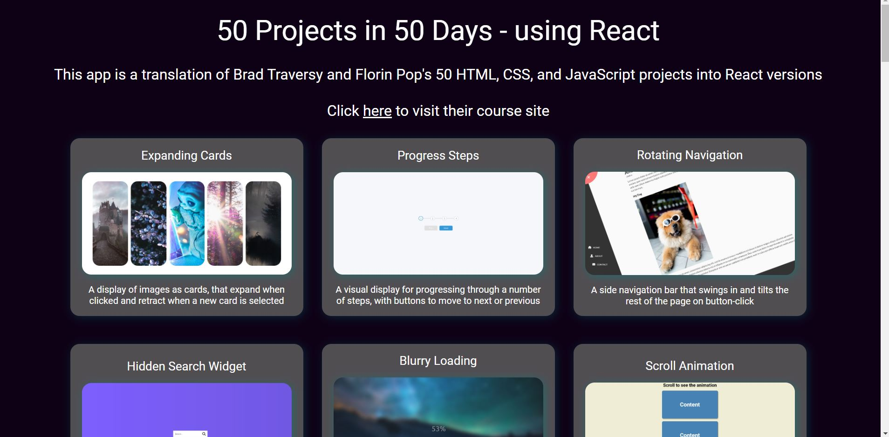

# 50 Projects in 50 Days

[Visit live site (DESKTOP ONLY)](https://50projectsinreact.netlify.app/)

## Screenshots

Project Page Example:

## The Concept

I treated myself to this [Udemy course](https://www.udemy.com/course/50-projects-50-days/?src=sac&kw=project) as I really liked the look of the small projects, and I also felt insecure about my knowledge of vanilla JavaScript - so this seemed like a fun way of exposing myself to more of that as well as learning new things.

The course is by [Brad Traversy](https://github.com/bradtraversy), with the projects designed by [Florin Pop](https://github.com/florinpop17).

As well as making the projects as per the course, I wanted to try and 'translate' or convert them into React, as oftentimes when I'm working on projects and find something that's done in vanilla JS, I struggle or can't figure out how to accomplish the same thing in an app.

## The App

Initially I said here that this could be considered a simple app in terms of it doesn't really 'do' anything, but oh boy was I naive. Some of the later projects are entirely app worthy on their own in my opinion, and things like the Notes App and Todo List have local storage and can actually be used.

Some of the projects really took a lot of research and trial and error to convert over, so for me the re-making of the original projects was a learning experience and lesson in perseverance. It's nice to have them all collected together, and I think it's a great little library of components and features that maybe I could use or implement in the future.

I also hope this helps other learners. The makers of the course are really popular and have a big following, so I know there can't just be me who wonders about trying to convert over the projects. I'd like to think this repo/app can help people who might be taking the course in future, or are researching some of the functionality. It would be nice to pay it back, having been helped by some many developers on the internet who'll never know they saved my day.

## Tech

React, CSS, JavaScript, HTML, Font-Awesome, React Intersection Observer, Axios, react-markdown, nanoid, Netlify

## Assets and Resources

[Unsplash - gorgeous free use images](https://unsplash.com/)

[Font-Awesome - icons](https://fontawesome.com/v5/docs/web/use-with/react)

[TheMovieDB - API for movie data](https://www.themoviedb.org/documentation/api)

[PokeApi - API for Pokemon data](https://pokeapi.co/)

[Random User Generator - API for user data](https://randomuser.me/)

[pngimg - web design resource](https://pngimg.com/)

## Some Thoughts

This project has been incredibly challenging at times but it's really made me feel more confident in my ability to work through problems and in my use of JavaScript. As a community, developers really are amazing - so many articles and tutorials and stackoverflow posts have gone into my being able to figure some of this stuff out.

I've also seen so many amazing things that can be accomplished without the use of special libraries and particularly with CSS. Some of these things I would never have even known to look up without this course - I just wouldn't have thought them possible/thought to think if they were!

I've learnt about [Font-Awesome](https://fontawesome.com/v5/docs/web/use-with/react) which is I'm grateful for after struggling with icons in the past, so this should be helpful in the future. The documentation on their site, however, is problematic as the React code snippets simply don't work - after quite a bit of faffing I managed to stumble onto the right way, but yeah... If you've had a painful experience with trying to implement this library take a look at some of these projects and you should see how easy it actually is once you know.

### Anytime you're using setInterval in React...

...you're probably going to have a bad time until you learn about cleanup functions. There's a link in the section below, but basically (forget I said that - nothing's basic about setInterval in React) you want to clear the setInterval... Definitely look it up if you're having a hard time with it, because it will make any project where you're dealing with timers/intervals a nightmare until you understand the fix (or at least copy and paste it in).

### Github Profiles

This is the first time I used Axios and I can see why people like it. It's not that different to fetch with async/await, but yeah.

### Notes App

I used local storage for the first time, and learned about setting it with useEffect and retrieving it directly in state because of useEffect being asynchronous (see useful links).

Also, I tried to use the marked npm library and found this wouldn't display the notes correctly (it would display the HTML markup in the note). Having researched, I switched to [react-markdown](https://www.npmjs.com/package/react-markdown) and was able to implement this successfully - though I did learn I had to write CSS styles for the functionality to work fully in displaying different styles.

### Hoverboard

This was definitely one of the harder conversions - I struggled with state management and how to pass IDs, as well as speed because of the way the 500 boxes were rendered.

I learned the importance of having an extra boolean state (or reference/id state), and how to set ternary conditions for this AND this, to be able to change state on one element not all.

I also learned that if you're returning a map of elements in the component (ie the boxes in this instance) - creating the array outside of the component and importing it in means that the map won't re-render every time state changes. When you think about it this makes sense as otherwise the array is getting created everytime so would be re-rendered, but until you realise...yeah this held me back a lot! I believe useMemo can also be handy in some situations but that's for another time.

### Password Strength Background

Here I more fought with CSS than anything - the original project used Tailwind but I didn't want to do this so I wrote my own CSS. This was fine until trying to get rid of the white edges on the blurred background (which actually were still a problem in the Tailwind version on the course). After trying multiple ways of removing this and not having scroll bars, I discovered a stackoverflow on the relationship between position absolute child components and overflow hidden - this is linked in Useful Links - and adding an extra div allowed me to get rid of both my scrollbars and white edges!

### Quiz App

I really struggled with state in this one, and from bringing over too much from the vanilla js that actually made my state control more difficult. I eventually found a tutorial where I could apply some of the logic as there were enough similarities, but yeah I found state very confusing on this one.

I also had to research how to have the radio buttons 'reset' when the next question came up, as the previous selection was still showing as checked. This took a little testing but was actually easy to implement once I found a good resource. (see below for links)

### Todo List

This one's difficulties lay in the retrieval of local storage, and the changing of the todo list state from checked to unchecked. I tried implementing some of the local storage logic I had from the Notes App and some worked but other bits didn't - I kept getting the todos state as [ null ] which prevented me being able to update it or render it in the return. I STILL don't know why, but somehow I managed to get away from that...

Never underestimate the power of deleting the code you have that's not working and starting over. Some things aren't meant to be saved.

I also learned the importance of setting a value on inputs in React, and that when you have a value you need an onChange function. The console will scream this at you if you don't want to take my word for it. The onChange sets a state - which is what you use as the value - and captures the user input by taking e.target.value. Might sound simple to some but yeah, to me this was a grateful revelation. If you're struggling with this problem and this writeup doesn't make sense, just take a look at the code and hopefully you can see from that.

### Catch Game

First of all apologies if you were expecting creepy crawlies (the course has this as an insect catch game) - I wasn't about to spend hours of my life looking at bugs.

I struggled with this in a good old-fashioned console log everything and try to figure out where it's going wrong kind of way. Initially I had a problem with the timer not functioning correctly, but I fixed this with a combination of stackoverflow and looking at my Theme Clock code.

Then I struggled with trying to apply the rotate and top/left styles for the snacks in the third screen - trial and error showed they only worked well one way round (for which there's probably a reason but I've been staring so long at the code now I can't see it - another day it will probably be obvious).

But mostly I struggled with updating the state for the snacks (returned in the map) in two places - removing snacks and adding them - and these state updates clashing and interrupting one another. Only moving things around fixed this, and I believe setTimeout and state asynchronicity were battling me.

### And overall

I really have learned throughout this entire project that sometimes you have to step back and go through things one by one. Comment a line of code out and run it again - what happens differently? Do you need a useEffect - do you know why you might? Console log the world.

I've really questioned why React, and libraries/frameworks in general, are so lauded over vanilla code. A lot of creation is achievable without these things, and in my experience here, more easily in a lot of cases! Perhaps this is still space for growth on my part, and I'm aware I'm not taking performance metrics into account as well as probably many other things - but these are just my thoughts.

I completed the Udemy course AND the React conversions in just over a month, and honestly I worked longer days than I probably should have :laugh: I wish I'd made more reflective notes on the earlier projects but oh well.

I think the main takeaway is that if something intimidates you or seems completely out of reach, it's not. It's a series of steps and struggles and that's it. You just keep going and then you look back and realise you've actually come quite a long way, even if there's still a ways to go.

In the words of Samwise Gamgee, "It's the job that's never started as takes longest to finish." So if you don't know how to do something just start from where you are now, because that's the only way you'll ever figure it out.

## Other Useful Links

[Expanding Cards Youtube Tutorial](https://www.youtube.com/watch?v=XmeGQ5cz_aI&t=3300s)

[Progress Steps Youtube Tutorial](https://www.youtube.com/watch?v=AmeoJ7Ngzd4)

[Using setInterval in React](https://overreacted.io/making-setinterval-declarative-with-react-hooks/) (Blurry Loading - percentage count-up)

[React Intersection Observer Docs](https://github.com/thebuilder/react-intersection-observer/blob/1b33c2b658bc06774b564d63dfcc4b07a5bee443/docs/Recipes.md) /
[React Intersection Observer](https://www.npmjs.com/package/react-intersection-observer) /
[React with Intersection Observer Tutorial - triggering events on scroll](https://www.youtube.com/watch?v=r1auJEf9ISo&t=587s) (Scroll Animation)

[Adding onMouseEnter in React](https://linguinecode.com/post/how-to-add-onmouseenter-or-onmouseover-in-reactjs) (Split Landing Page)

[Pausing Audio in React - good prompt for all parts of playing audio though](https://stackoverflow.com/questions/63003690/unable-to-pause-audio-in-reactjs) (Sound Board)

[Detect Any Key Press in React JS](https://www.youtube.com/watch?v=D5SdvGMTEaU) (Event Keycodes)

[React useRef Hook](https://www.w3schools.com/react/react_useref.asp) / [How to autoincrement a number in React](https://stackoverflow.com/questions/69948830/react-how-to-autoincrement-number-from-0-to-a-certain-value) (Increment Counter)

[Make one true while others in object false](https://stackoverflow.com/questions/64011608/make-one-true-while-others-in-object-to-false-in-react-hooks) / [TO LOOK AT: Conditional CSS in React](https://medium.com/@nethelbert.blasse/conditional-css-in-react-f47084e44f35) / [TO LOOK AT: Set Class Conditonally React](https://codefrontend.com/set-class-conditionally-react/) (Drink Water)

[How to implement a search bar in React](https://plainenglish.io/blog/how-to-implement-a-search-bar-in-react-js) / [Clearing a form upon submit](https://stackoverflow.com/questions/70362095/how-to-clear-input-after-submit-with-react) (Movie App)

[Light/Dark Mode Toggle in React Tutorial](https://www.youtube.com/watch?v=VzF2iTTc0MA) / [Build an Analog Clock in Javascript - has different logic for the clock needles/hands which helped solve needles travelling backward on 0](https://www.youtube.com/watch?v=hbe2hn4W3z0) (Theme Clock)

[How to create Ripple Button using React](https://www.youtube.com/watch?v=MK309yA22pM) (Button Ripple Effect)

[How to Implement Drag and Drop Feature for your React Component](https://www.pluralsight.com/guides/implement-drag-drop-react-component) (Drag N Drop)

[Building a Drawing App using Canvas and React](https://www.youtube.com/watch?v=_N9xf1r1yD4) / [Mouse Position](https://stackoverflow.com/questions/17130395/real-mouse-position-in-canvas) (Drawing App)

[Create a Toast Notification Component with React](https://www.youtube.com/watch?v=kkA_iMkSJDk) (Toast Notification - explanation RE removing toasts and closure issues with useEffect)

[How to get form input value on submit in React](https://codingbeautydev.com/blog/react-get-form-input-value-on-submit/) (Github Profiles)

[Code your own Typing Effect with React](https://www.youtube.com/watch?v=N4899I-tAW4) (Auto Text Effect - the useEffect to actually run the animation the first time)

[How to create a React checkbox](https://www.robinwieruch.de/react-checkbox/) / [Copying text to clipboard in React](https://stackoverflow.com/questions/39501289/in-reactjs-how-to-copy-text-to-clipboard) (Password Generator)

[Problems with local storage resetting/not retrieving](https://stackoverflow.com/questions/72222728/why-is-localstorage-getting-cleared-whenever-i-refresh-the-page) / [React state not updating immediately](https://www.daggala.com/react-state-not-updating-immediately/) / [React Notes App Tutorial](https://www.youtube.com/watch?v=8KB3DHI-QbM) (Notes App)

[Absolute position and overflow hidden](https://stackoverflow.com/questions/5513382/absolute-position-and-overflowhidden) (Password Strength Background)

[Clear Input Value in React](https://bobbyhadz.com/blog/react-clear-input-value) (Verify Account UI)

[Search Filter React Tutorial](https://www.youtube.com/watch?v=mZvKPtH9Fzo&t=39s) (Live User Filter)

[Coding a Quiz App in React](https://www.youtube.com/watch?v=8LNb18ibNGs) / [Handle and manage radio button state in React](https://surajsharma.net/blog/react-handle-radio-buttons) (Quiz App)

[Build a todo list app with React](https://www.youtube.com/watch?v=6otDXxMHnk0) (Todo List)

[Start the timer when a button's clicked](https://stackoverflow.com/questions/51978683/start-the-timer-when-button-is-clicked-in-react-js) (Catch Game)
