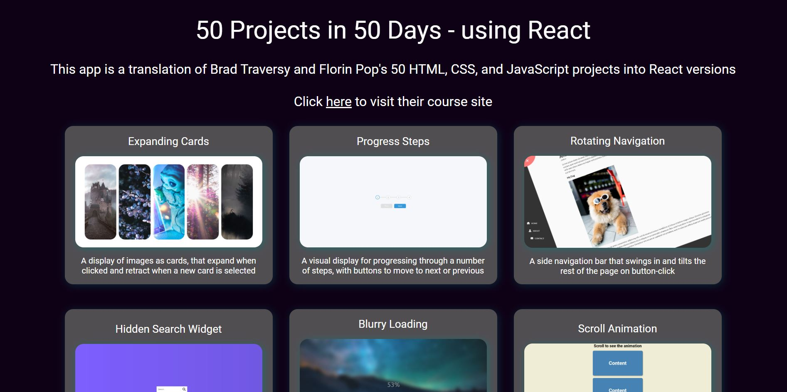

# 50 Projects in 50 Days

[Visit live site (DESKTOP ONLY)](https://50projectsinreact.netlify.app/)

## Screenshots

Project Page Example:

## The Concept

I treated myself to this [Udemy course](https://www.udemy.com/course/50-projects-50-days/?src=sac&kw=project) as I really liked the look of the small projects, and I also feel a bit insecure about my knowledge of vanilla JavaScript - so this seemed like a fun way of exposing myself to more of that as well as learning new things.

The course is by [Brad Traversy](https://github.com/bradtraversy), with the projects designed by [Florin Pop](https://github.com/florinpop17).

As well as making the projects, I wanted to try and 'translate' them into React, as oftentimes when I'm working on projects and find something that's done in vanilla JS, I struggle or can't figure out how to accomplish the same thing in an app.

## The App

This could be considered a simple app in terms of it doesn't really 'do' anything, but some of the projects really take a lot of research and trial and error to implement! So for me, the re-making of the projects is a learning experience. It's nice to have them all collected together, and I think it's a nice little library of components and features that maybe I could use or implement in the future.

## Tech

React, CSS, JavaScript, HTML, Font-Awesome, React Intersection Observer, Netlify

## Some Thoughts

This project is obviously ongoing, but so far I'm finding it really useful in that it's making me feel more confident about JavaScript, and challenging in that some of this is really difficult to figure out! A couple of the projects I really struggled to re-make in React, but thankfully found tutorials to help - others, however, have been surprisingly easy to translate over so that's been nice!

I've learnt about [Font-Awesome]() which is great, because this will be so helpful when needing icons in the future. The documentation on their site, however, is problematic as the React code snippets simply don't work - after quite a bit of faffing I managed to stumble onto the right way, but yeah...

I'm also picking up new things in CSS with styling some of the elements, which is always nice :smile:

## Other Useful Links

[Expanding Cards Youtube Tutorial](https://www.youtube.com/watch?v=XmeGQ5cz_aI&t=3300s)

[Progress Steps Youtube Tutorial](https://www.youtube.com/watch?v=AmeoJ7Ngzd4)

[Using setInterval in React](https://overreacted.io/making-setinterval-declarative-with-react-hooks/) (Blurry Loading - percentage count-up)

[React Intersection Observer Docs](https://github.com/thebuilder/react-intersection-observer/blob/1b33c2b658bc06774b564d63dfcc4b07a5bee443/docs/Recipes.md) /
[React Intersection Observer](https://www.npmjs.com/package/react-intersection-observer) /
[React with Intersection Observer Tutorial - triggering events on scroll](https://www.youtube.com/watch?v=r1auJEf9ISo&t=587s) (Scroll Animation)

[Adding onMouseEnter in React](https://linguinecode.com/post/how-to-add-onmouseenter-or-onmouseover-in-reactjs) (Split Landing Page)

[Pausing Audio in React - good prompt for all parts of playing audio though](https://stackoverflow.com/questions/63003690/unable-to-pause-audio-in-reactjs) (Sound Board)

[Detect Any Key Press in React JS](https://www.youtube.com/watch?v=D5SdvGMTEaU) (Event Keycodes)

[React useRef Hook](https://www.w3schools.com/react/react_useref.asp) / [How to autoincrement a number in React](https://stackoverflow.com/questions/69948830/react-how-to-autoincrement-number-from-0-to-a-certain-value) (Increment Counter)

[Make one true while others in object false](https://stackoverflow.com/questions/64011608/make-one-true-while-others-in-object-to-false-in-react-hooks) / [TO LOOK AT: Conditional CSS in React](https://medium.com/@nethelbert.blasse/conditional-css-in-react-f47084e44f35) / [TO LOOK AT: Set Class Conditonally React](https://codefrontend.com/set-class-conditionally-react/) (Drink Water)

[How to implement a search bar in React](https://plainenglish.io/blog/how-to-implement-a-search-bar-in-react-js) / [Clearing a form upon submit](https://stackoverflow.com/questions/70362095/how-to-clear-input-after-submit-with-react) (Movie App)

[Light/Dark Mode Toggle in React Tutorial](https://www.youtube.com/watch?v=VzF2iTTc0MA) / [Build an Analog Clock in Javascript - has different logic for the clock needles/hands which helped solve needles travelling backward on 0](https://www.youtube.com/watch?v=hbe2hn4W3z0) (Theme Clock)

[How to create Ripple Button using React](https://www.youtube.com/watch?v=MK309yA22pM) (Button Ripple Effect)

[How to Implement Drag and Drop Feature for your React Component](https://www.pluralsight.com/guides/implement-drag-drop-react-component) (Drag N Drop)
